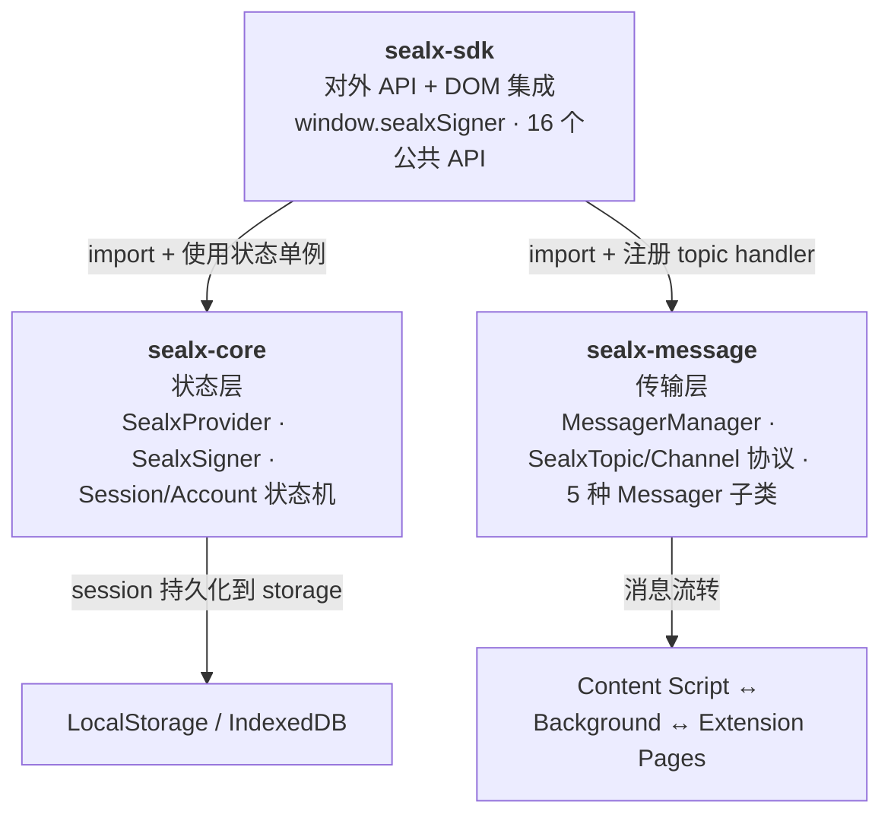
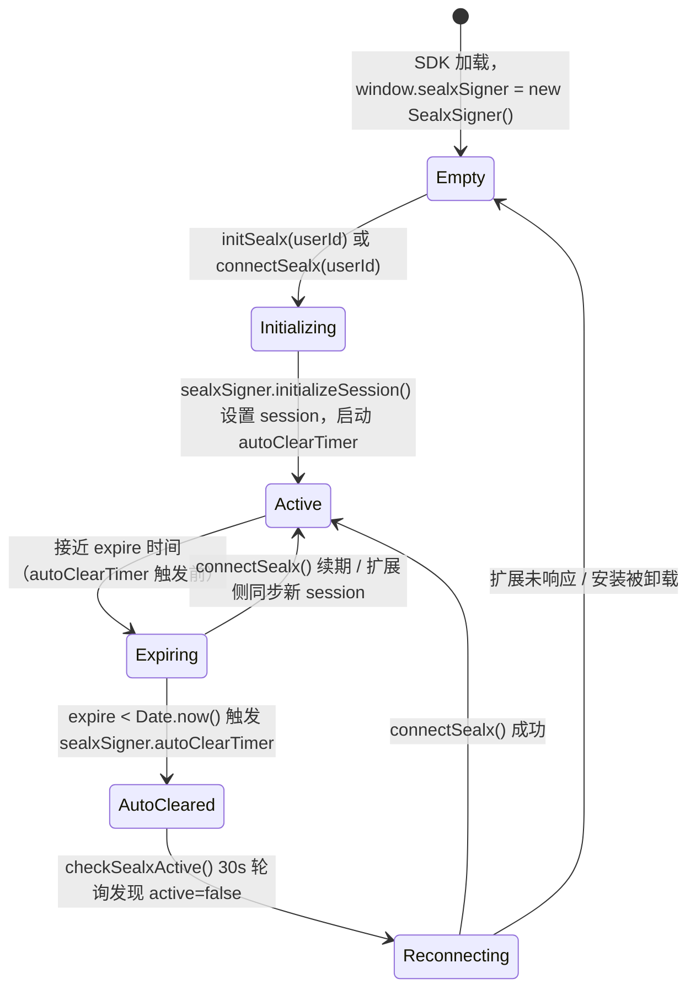
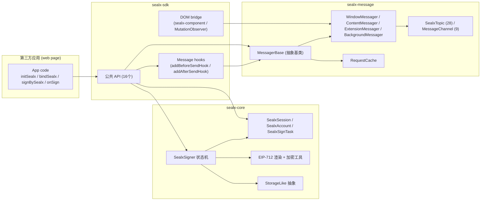

# SealX SDK 内部架构文档

> **目标读者**：维护 SealX 项目的内部开发者。
> **阅读前提**：对 TypeScript、Chrome Extension APIs、浏览器 DOM 有基础了解。
> **可验证性原则**：每个架构描述引用至少一个源码位置，读者可跳转源码验证。

---

## 1. 三层架构概览



**依赖方向**：单向。`sealx-sdk` 消费 `sealx-core` + `sealx-message`；`sealx-core` 与 `sealx-message` 之间无依赖。

---

## 2. 各层职责与关键导出

### 2.1 sealx-sdk — 对外 API + DOM 集成

**职责**：为第三方前端应用提供"开箱即用"的签名 SDK。把 `sealx-core` 的状态管理与 `sealx-message` 的协议抽象封装成 16 个公共 API 和 DOM 集成。

**关键文件**：
- `packages/sealx-sdk/src/index.ts` — 主入口，全部 16 个公共 API
- `packages/sealx-sdk/src/components/{bind,sign}/` — `sealx-component` 按钮逻辑
- `packages/sealx-sdk/src/exceptions/` — SDK 层 5 个异常类
- `packages/sealx-sdk/src/state/` — `plugin-state.ts` / `session.ts` 状态模型

**公共 API 速查**（详见对外 `api-reference.md`）：
- **Lifecycle**: `isSealxActive` / `initSealx` / `connectSealx` / `closeSealx` / `checkSealx` / `checkSealxActive` / `isSessionAvailable` / `sealxActive`（deprecated）
- **Signing**: `bindSealx` / `signBySealx` / `sendSignResponse` / `onSign`
- **DOM Integration**: `setupSealxActions` / `registerLocatableKeys` / `onLocateElement`
- **Events**: `onPanelClose`

---

### 2.2 sealx-core — 状态层

**职责**：管理签名会话（Session）和账号（Account）状态；提供单例工厂、EIP-712 渲染管线、加密工具。

**关键文件**：
- `packages/sealx-core/src/index.ts` — barrel exports
- `packages/sealx-core/src/sealx/sealx-provider.ts` — `SealxProvider.register()` 单例工厂
- `packages/sealx-core/src/sealx/sealx-signer.ts` — `SealxSigner` 类（核心状态机）
- `packages/sealx-core/src/sealx/sealx-interface.ts` — `SealxSession` / `SealxAccount` / `SealxSignTask` 类型
- `packages/sealx-core/src/eip712/` — EIP-712 结构定义
- `packages/sealx-core/src/storage/` — `StorageLike` 抽象（localStorage / IndexedDB）
- `packages/sealx-core/src/tabs/tab-manager.ts` — `TabManager`（扩展上下文使用）

**公共导出**：
- 类型：`SealxSignTask` / `SealxSession` / `SealxAccount` / `SignContent` / `Eip712Struct` / `SealxProvider` / `SealxSigner` / `TabManager`
- 工具函数：`wait` / `localStorageWrapper` / `dbStorageWrapper` / `deriveKeyFromPin` / `encryptPrivateKey` / `decryptPrivateKey`
- 异常：`PinError` / `DataCorruptedError`

---

### 2.3 sealx-message — 传输层

**职责**：定义消息协议（`SealxTopic` / `MessageChannel`）和传输抽象（`MessagerBase` + 5 种环境适配子类），并提供请求/响应关联机制。

**关键文件**：
- `packages/sealx-message/src/index.ts` — barrel exports
- `packages/sealx-message/src/enums/index.ts` — `SealxTopic`（28 个）/ `MessageChannel`（9 个）枚举
- `packages/sealx-message/src/messager/messager-manager.ts` — `MessagerManager.getMessager()` 工厂
- `packages/sealx-message/src/messager/messager.ts` — `MessagerBase` 抽象基类（633 行）
- `packages/sealx-message/src/messager/{window,content,extension,background}-messager.ts` — 4 种环境适配
- `packages/sealx-message/src/contracts/` — `SealxRequest` / `SealxResponse` / `MessageHandle` 等类型契约
- `packages/sealx-message/src/request-cache/` — `RequestCache` 持久化挂起请求
- `packages/sealx-message/src/message-channel.ts` — `Channel` / `ChannelManager`（基于 `chrome.runtime.Port` 的长连接）

**公共导出**：
- 枚举：`SealxTopic` / `MessageChannel`
- 类：`MessagerManager` / `WindowMessager` / `ContentMessager` / `ExtensionMessager` / `BackgroundMessager` / `Channel` / `ChannelManager`
- 类型：`SealxRequest` / `SealxResponse` / `MessageHandle` / `MessageSend` / `MessageSendStream` / `MessageBeforeSendHook` / `MessageAfterSendHook`

---

## 3. 单例模式：`window.sealxSigner`

### 3.1 `SealxProvider.register()`

**源码位置**：`packages/sealx-core/src/sealx/sealx-provider.ts`

```typescript
export class SealxProvider {
    static register() {
        if (!window.sealxSigner) {
            window.sealxSigner = new SealxSigner();
        }
        return window.sealxSigner;
    }
}
```

- **幂等**：如果 `window.sealxSigner` 已存在则直接返回，不会重建。
- **时机**：`sealx-sdk` 在模块顶层加载时立即调用（`sealx-sdk/src/index.ts:51`），确保所有 API 调用时 `window.sealxSigner` 已就绪。
- **全局可见**：TypeScript 通过 `declare global { interface Window { sealxSigner: SealxSigner } }` 在 `sealx-provider.ts` 中增强 `Window` 类型。

### 3.2 `SealxSigner` 状态模型

**源码位置**：`packages/sealx-core/src/sealx/sealx-signer.ts`

| 字段 | 类型 | 默认值 | 含义 |
|---|---|---|---|
| `id` | `string` | 随机 26 字符字母数字 | 实例唯一标识（用于日志关联） |
| `installed` | `boolean` | `false` | 扩展已安装（一次 true，不回落） |
| `active` | `boolean` | `false` | 扩展当前活跃（UI 可见/可响应） |
| `connected` | `boolean` | `false` | 是否已建立会话连接 |
| `session` | `SealxSession \| null` | `null` | 当前会话，过期后自动清空 |
| `account` | `SealxAccount \| null` | `null` | 当前账号（含 `pk` / `newPk`） |
| `autoConnectCallback` | `(() => void) \| null` | `null` | 会话自动过期时的回调 |
| `autoClearTimer` | `any` | `null` | 会话过期清理定时器引用 |
| `autoCheckTimer` | `any` | `undefined` | 自动检查定时器引用（30s 间隔） |
| `storageWrapper` | `StorageLike` | `localStorageWrapper('sealx', 'state')` | 状态持久化后端 |

**关键方法**（`sealx-signer.ts` 中）：
- `initialize()` — 从 storage 加载 `installed` / `account` / `session`，设置 autoClearTimer，监听 `[data-sealx-signer-active]` 属性
- `initializeAccount(account)` — 更新 `this.account` 并持久化
- `initializeSession(session)` — 更新 `this.session`、持久化、启动过期清理
- `install()` — 标记已安装（一次性）
- `activate()` / `deactivate()` — 设置 `active` 并在 `document.body` 上切换 `data-sealx-signer-active="true"` DOM 属性
- `autoCheck(checker)` — 30s 间隔轮询 checker，根据结果切换 `active` / 重置 `session`

### 3.3 `SealxSession` 类型

**源码位置**：`packages/sealx-core/src/sealx/sealx-interface.ts`

| 字段 | 类型 | 含义 |
|---|---|---|
| `sessionId` | `string` | 会话唯一标识 |
| `userId` | `string?` | 用户标识（认证系统提供） |
| `address` | `string` | 与本次会话绑定的地址 |
| `expire` | `number` | 过期时间（毫秒 Unix 时间戳） |
| `host` | `string?` | 发起会话的 host 信息 |
| `capabilityId` | `string?` | 运行时授权能力（纯元数据，不含私钥） |
| `pk` | `any` | 会话绑定的公钥 |
| `pkKdf` | `'sha256-v1' \| 'md5-legacy'?` | 公钥使用的 KDF 算法 |

### 3.4 `SealxAccount` 类型

**源码位置**：`packages/sealx-core/src/sealx/sealx-interface.ts`

| 字段 | 类型 | 含义 |
|---|---|---|
| `id` | `string?` | 数据库主键 |
| `userId` | `string \| number?` | 用户标识（来自认证系统） |
| `email` | `string?` | 邮箱 |
| `userName` | `string?` | 显示名 |
| `pk` | `string?` | SealX 地址对应的公钥 |
| `newPk` | `string?` | 新增/待确认的公钥（换钥场景） |

**换钥约束**（`sealx-sdk/src/index.ts:628-635`）：
- 当 `account.newPk` 存在且与 `account.pk` 不一致时，`signBySealx` 抛 `PkException`。
- 必须在 `bindSealx` 成功后把 `newPk` 提交到服务端、再用新 pk 覆盖 `account.pk`，才能继续签名。

### 3.5 `SealxSignTask` 类型

**源码位置**：`packages/sealx-core/src/sealx/sealx-interface.ts`（L82-119）

| 字段 | 类型 | 必填 | 含义 |
|---|---|---|---|
| `taskId` | `string` | ✅ | 签名任务唯一 ID（如 `"task_xyz789"`） |
| `taskType` | `string` | ✅ | 任务类型（如 `"eip712"` / `"raw"`） |
| `command` | `string` | ✅ | 签名命令（如 `"signPersonal"` / `"signTypedData"`） |
| `signContent` | `SignContent \| { taskId, signContent }[]` | ✅ | 单个 `SignContent` 或批量数组 |
| `validUntilTime` | `string` | ✅ | 签名有效期单位（`"seconds"` / `"minutes"` / `"hours"`） |
| `preViewUrl` | `string` | ❌ | 第三方任务预览页 URL |
| `extenals` | `Record<string, unknown>` | ❌ | 额外外部数据（key-value map） |

---

## 4. Session 生命周期（状态机）



**状态转换触发点**（每条附源码位置）：

| 转换 | 触发代码 | 源码位置 |
|---|---|---|
| Empty → Initializing | `initSealx()` / `connectSealx()` 入口 | `sealx-sdk/src/index.ts:300` / `:383` |
| Initializing → Active | `sealxSigner.initializeSession(session)` + `autoClearTimer` 启动 | `sealx-core/src/sealx/sealx-signer.ts` `initializeSession` 方法 |
| Active → Expiring | 业务侧通过 `addAfterSendHook` 检测到 response 中新的 session | `sealx-sdk/src/index.ts:75-90` |
| Expiring → Active | `connectSealx()` 拿到 extension 返回的 session 并更新 | `sealx-sdk/src/index.ts:439` |
| Expiring → AutoCleared | `expire < Date.now()` 触发内置 timer | `sealx-core/src/sealx/sealx-signer.ts` `autoClearTimer` |
| AutoCleared → Reconnecting | `checkSealxActive()` 每 2 秒检查 `isSealxActive()` | `sealx-sdk/src/index.ts:964` |
| Reconnecting → Active | `connectSealx()` 成功 | 同上 |
| Reconnecting → Empty | `checkSealx()` 连续 3 次失败 → `sealxSigner.deactivate()` | `sealx-sdk/src/index.ts:904-928` |

**缓存和 TTL 细节**：

- `isSealxActive()` 自身有 5 秒 TTL 缓存（`sealx-sdk/src/index.ts:216`），避免频繁发消息。
- `checkSealx()` 用 3 次 × 100ms 重试（`sealx-sdk/src/index.ts:904`）。
- `checkSealxActive()` 用 `setInterval(..., 2000)` 每 2 秒轮询（`sealx-sdk/src/index.ts:964`）。
- `sealxSigner.autoCheck()` 在扩展上下文中用 30 秒轮询（`sealx-core/src/sealx/sealx-signer.ts` `autoCheck` 方法）——注意这是扩展侧用的，SDK 侧不用。

---

## 5. 环境自适应：`MessagerManager.getMessager()`

**源码位置**：`packages/sealx-message/src/messager/messager-manager.ts`

`MessagerManager.getMessager()` 是纯工厂方法，根据当前执行环境返回对应的 `MessagerBase` 子类实例。SDK 作为第三方集成运行在 web 页面，始终得到 `WindowMessager`。

| 检测条件 | 返回实现 | 传输方式 | 典型运行场景 |
|---|---|---|---|
| `chrome.runtime.id` 存在 + `location.protocol === 'chrome-extension:'` | `ExtensionMessager` | `chrome.runtime.sendMessage` / `chrome.tabs.sendMessage` | popup / options / sidebar 页面 |
| `chrome.runtime.id` 存在 + 非 `chrome-extension:` 协议 | `ContentMessager` | 双通道：`window.postMessage`（↔ inpage）+ `chrome.runtime.sendMessage`（↔ background） | web 页面中的 content script |
| `typeof window === 'undefined'` | `BackgroundMessager` | `chrome.runtime.onMessage` / `chrome.tabs.sendMessage` | service worker（background script） |
| 都不满足 | `WindowMessager` | 纯 `window.postMessage` / `window.addEventListener('message')` | 普通 web 页面中的 inpage script |

**SDK 使用场景**：
- `sealx-sdk` 运行在第三方 web 页面中（inpage script 上下文），所以 `MessagerManager.getMessager()` 返回 `WindowMessager` 实例。
- `WindowMessager` 通过 `window.postMessage` 与 content script 通信（`packages/sealx-message/src/messager/window-messager.ts`）。
- Content script 再用 `chrome.runtime.sendMessage` 把消息转发给 background script。

**Channel 字段填充**：
- `ExtensionMessager` 根据 `<meta name="extension-context">` 标签值决定自身 channel（POPUP / OPTIONS / SIDEBAR / EXTENSION），缺省 EXTENSION。
- `WindowMessager` 的 channel 为 `INPAGE`，在 iframe 中则为 `IFRAME`（`window.self !== window.top` 检测）。
- `ContentMessager` 的 channel 为 `CONTENT`。
- `BackgroundMessager` 的 channel 为 `BACKGROUND`。

---

## 6. 依赖方向与职责边界



**职责边界原则**：
- **`sealx-sdk` 不应直接**：`window.postMessage`（通过 `WindowMessager`）、`chrome.*` API（通过 `BackgroundMessager` 等）、`localStorage` / `indexedDB`（通过 `StorageLike`）。
- **`sealx-core` 不应直接**：任何浏览器扩展 API 或 web 通信 API。它只做状态管理。
- **`sealx-message` 不应直接**：依赖 `SealxSigner` 状态或 EIP-712 渲染。它只关心消息路由和传输。

---

## 7. 关键架构约束（维护者必读）

1. **不要修改 `SealxProvider.register()` 的幂等性**。它被 SDK 顶层模块立即调用，任何重建都会导致 `window.sealxSigner` 状态丢失。
2. **不要改变 `MessagerBase` 的 hook 注册顺序假设**。`addBeforeSendHook` 按注册顺序串行执行，`addAfterSendHook` 同样。SDK 在 `sealx-sdk/src/index.ts:84-101` 注册了两个关键 hook，它们的顺序依赖 response 已带上 session 才能正确同步。
3. **不要跳过 `RequestCache` 的写入**。任何在 web 页面 → content script → background 的长链路请求都可能因页面刷新而中断，`RequestCache` 是让请求跨页面恢复的唯一手段。
4. **`SealxTopic.ALL` 和 `MessageChannel.ALL` 是通配符**。handler 注册时不要误用，否则会把无关消息都路由进来。
5. **Session 过期逻辑分散在三处**：`sealx-core` 的 autoClearTimer、`sealx-sdk` 的 5s 缓存、`isSessionAvailable()` 的实时检查。任何改动 session 的代码必须同时评估三处影响。
6. **`SealxTopic.CHECK_INITIALIZED` 双重用途**：
   - 主动：`checkSealx()` 发消息等 response。
   - 被动：`checkSealxActive()` 用 `messager.on(CHECK_INITIALIZED, ...)` 监听 background 推送的状态变更。
   不要修改 topic 的语义或 channel 方向。

---

## 8. 关联文档

- **消息协议详细**：[`./message-protocol.md`](./message-protocol.md) — SealxTopic × MessageChannel 矩阵、payload 结构、Mermaid 时序图
- **Session 与 Hooks 详解**：[`./session-and-hooks.md`](./session-and-hooks.md) — before/after send hooks 的 WHY、cache TTL 全景、session 过期时间线
- **对外对接指南**：[`packages/sealx-sdk/docs/integration-guide.md`](../../../packages/sealx-sdk/docs/integration-guide.md) — 给外部前端开发者的接入教程
- **对外 API Reference**：[`packages/sealx-sdk/docs/api-reference.md`](../../../packages/sealx-sdk/docs/api-reference.md) — 完整 API 参数/返回/异常
