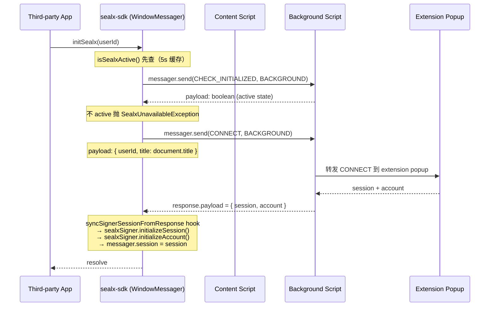
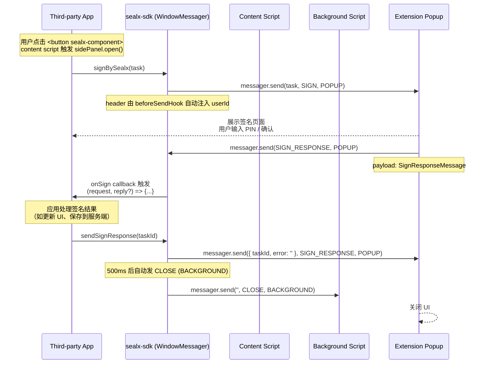
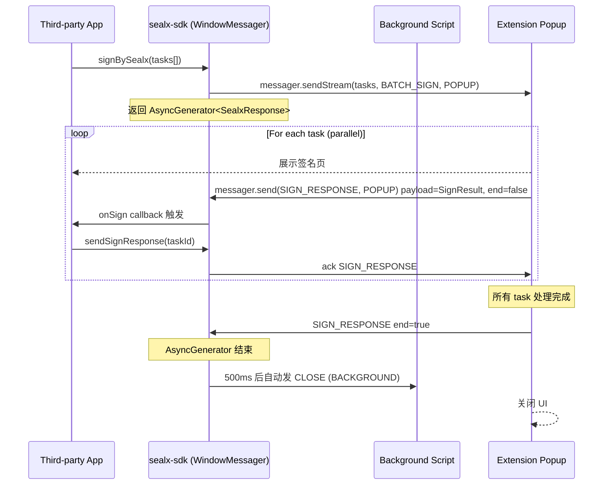
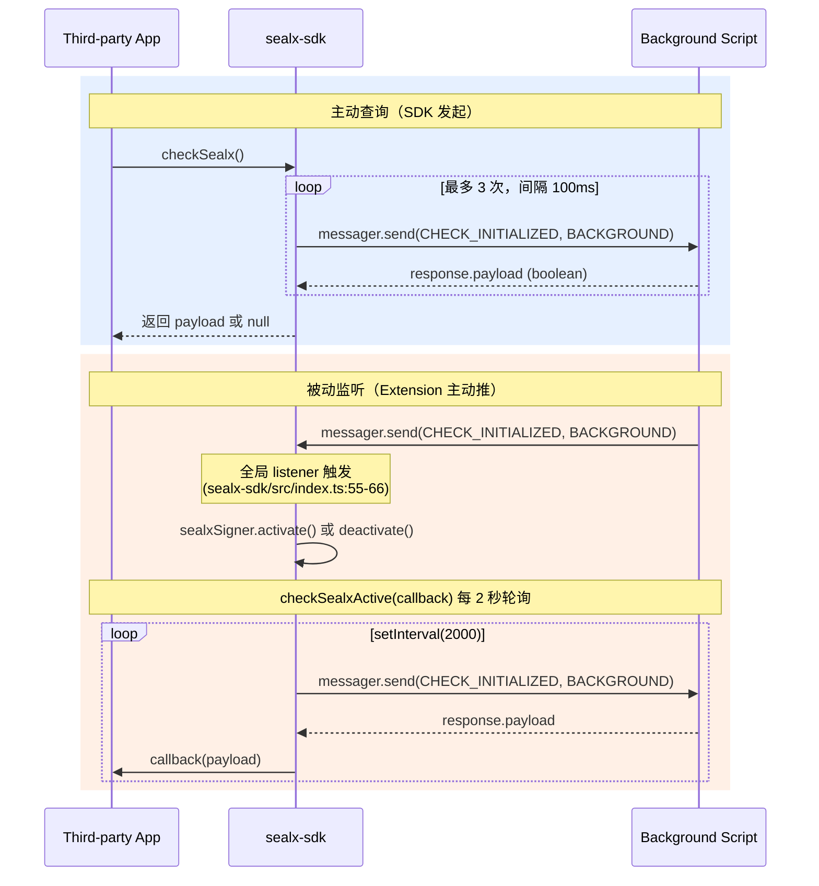

# SealX SDK 消息协议文档

> **目标读者**：维护 SealX 项目的内部开发者。
> **阅读前提**：已读完 [`./architecture.md`](./architecture.md) 了解三层架构。
> **重点**：本文档展示完整的 `SealxTopic` × `MessageChannel` 协议细节，以及 SDK 实际使用的消息流。对外文档（`api-reference.md`）**只暴露 topic 名字**，不暴露 payload 结构。

---

## 1. `MessageChannel` 枚举（9 个值）

**源码位置**：`packages/sealx-message/src/enums/index.ts`（L83-102）

| 枚举键 | 字符串值 | 用途 | SDK 是否使用 |
|---|---|---|---|
| `BACKGROUND` | `'background'` | Background script 通信（service worker） | ✅ 使用 |
| `POPUP` | `'popup'` | Popup 页面通信 | ✅ 使用 |
| `OPTIONS` | `'options'` | Options 页面通信 | ❌ |
| `SIDEBAR` | `'sidebar'` | Sidebar panel 通信 | ❌ |
| `EXTENSION` | `'extension'` | 扩展级通信（缺省） | ❌ |
| `CONTENT` | `'content'` | Content script 通信 | ❌（SDK 不直接用，但 content script 用） |
| `INPAGE` | `'inpage'` | Inpage script 通信 | ❌（WindowMessager 默认 channel） |
| `IFRAME` | `'iframe'` | Iframe 通信 | ❌ |
| `ALL` | `'*'` | 通配符 | ✅（handler 注册） |

**SDK 使用的 channel 仅 `BACKGROUND` 和 `POPUP`**。

---

## 2. `SealxTopic` 枚举（28 个值）

**源码位置**：`packages/sealx-message/src/enums/index.ts`（L4-77）

| 枚举键 | 字符串值 | 含义 | SDK 是否使用 |
|---|---|---|---|
| `CONNECT` | `'connect'` | 建立 wallet/account 连接 | ✅ |
| `CHECK_ACTIVED` | `'check-actived'` | 检查插件是否激活 | ❌ |
| `CONNECTED` | `'connected'` | 连接已建立 | ❌ |
| `DISCONNECT` | `'disconnect'` | 断开当前连接 | ❌ |
| `SIGN` | `'sign'` | 单次签名请求 | ✅ |
| `REMOTE_SIGN` | `'remote-sign'` | 远程签名 | ❌ |
| `SIGN_RESPONSE` | `'sign-response'` | 签名响应回传 | ✅ |
| `BATCH_SIGN` | `'batch-sign'` | 批量签名请求 | ✅ |
| `DEL_SIGN` | `'del-sign'` | 删除/撤销签名 | ❌ |
| `GET_TAB_ID` | `'get-tab-id'` | 获取当前 tab ID | ❌ |
| `GET_EXTENSION_ID` | `'get-extension-id'` | 获取扩展 ID | ❌ |
| `GET_ACCOUNT` | `'get-account'` | 获取当前账号信息 | ❌ |
| `CHECK_INITIALIZED` | `'check-initialized'` | 检查扩展已初始化 | ✅ |
| `CHECK_SESSION_EXPIRED` | `'check-session-expired'` | 检查 session 是否过期 | ❌ |
| `CHECK_PIN` | `'check-pin'` | 验证 PIN 码 | ❌ |
| `INITIALIZE` | `'initialize'` | 初始化 SealX 服务 | ❌ |
| `GET_SCREEN_OFF_TIMER` | `'get-screen-off-timer'` | 获取熄屏计时器 | ❌ |
| `SET_SCREEN_OFF_TIMER` | `'set-screen-off-timer'` | 设置熄屏计时器 | ❌ |
| `RESET_PIN` | `'reset-pin'` | 重置 PIN 码 | ❌ |
| `LOGIN` | `'login'` | 登录 | ❌ |
| `CHECK_ACTIVE` | `'check-active'` | 检查 active 状态 | ❌ |
| `BIND_PK` | `'bind-pk'` | 绑定公钥 | ✅ |
| `IMPORT_KEY` | `'import-key'` | 导入密钥 | ❌ |
| `PK_HEX` | `'pk-hex'` | 导出私钥为 hex | ❌ |
| `CLOSE` | `'close'` | 关闭连接 | ✅ |
| `VERIFY_TEMP_CODE` | `'verify-temp-code'` | 验证临时导入码 | ❌ |
| `LOCATE_ELEMENT` | `'locate-element'` | 在页面中定位元素 | ✅ |
| `ALL` | `'*'` | 通配符 | ✅（handler 注册） |
| `PANEL_CLOSE` | `'sealx-panel-close'` | Side panel 关闭事件 | ✅ |

**SDK 使用的 topic 共 9 个**：`CONNECT` / `CHECK_INITIALIZED` / `BIND_PK` / `SIGN` / `BATCH_SIGN` / `SIGN_RESPONSE` / `CLOSE` / `LOCATE_ELEMENT` / `PANEL_CLOSE`。

---

## 3. SDK 使用的 Topic × Channel 矩阵

| Topic ↓ / Channel → | `BACKGROUND` | `POPUP` | 发送方 | 接收方 |
|---|---|---|---|---|
| `CONNECT` | ✅ SDK→Ext | — | web page（SDK） | extension background |
| `CHECK_INITIALIZED` | ✅ SDK↔Ext 双向 | — | web page（SDK） ↔ extension background | 主动查询 + 被动监听 |
| `BIND_PK` | — | ✅ SDK→Ext | web page（SDK） | extension popup（打开 popup 让用户操作） |
| `SIGN` | — | ✅ SDK→Ext | web page（SDK） | extension popup |
| `BATCH_SIGN` | — | ✅ SDK→Ext（流式） | web page（SDK） | extension popup |
| `SIGN_RESPONSE` | — | ✅ SDK↔Ext 双向 | web page（SDK） ↔ extension popup | 签名结果回传 |
| `CLOSE` | ✅ SDK→Ext | — | web page（SDK） | extension background |
| `LOCATE_ELEMENT` | — | ✅ Ext→SDK | extension popup | web page（SDK） |
| `PANEL_CLOSE` | ✅ Ext→SDK | — | extension background | web page（SDK） |

**关键流向**：
- **SDK 主动发起**：`CONNECT` / `CHECK_INITIALIZED` / `BIND_PK` / `SIGN` / `BATCH_SIGN` / `CLOSE`
- **Extension 主动发起**：`LOCATE_ELEMENT` / `PANEL_CLOSE`
- **双向响应**：`CHECK_INITIALIZED`（SDK 主动查，Extension 也会主动推状态变更）/ `SIGN_RESPONSE`（Extension 推签名结果，SDK 调 `sendSignResponse` 回 ack）

---

## 4. 消息契约：`SealxRequest` 与 `SealxResponse`

### 4.1 `SealxRequest<M, T, R>`

**源码位置**：`packages/sealx-message/src/contracts/request.ts`

| 字段 | 类型 | 含义 |
|---|---|---|
| `topic` | `T` (extends `SealxTopic`) | 消息主题 |
| `header` | `SealxHeader` | 消息头（含 `host` / `userId` / `requestId` / `sessionId` / `messagerId` / `tabId` / `fullscreen`） |
| `receiver` | `MessageChannel` | 目标 channel |
| `sender` | `MessageChannel` | 发送方 channel |
| `once` | `boolean?` | 一次性请求标记 |
| `payload` | `M` | 消息 payload |
| `reply` | `ReplyFunc?` | 可选回传函数 |

### 4.2 `SealxResponse<M, T>`

**源码位置**：`packages/sealx-message/src/contracts/response.ts`

继承 `SealxRequest<M, T>` 并追加：

| 字段 | 类型 | 含义 |
|---|---|---|
| `responseId` | `string` | 唯一响应 ID（与请求的 `requestId` 关联） |
| `session` | `SealxSession?` | 可选 session（`MessagerBase` 自动用它更新 `messager.session`） |
| `error` | `string?` | 错误信息（表示响应是失败） |
| `end` | `boolean` | 流式响应标记（`true` 表示最后一个 chunk） |

### 4.3 `SealxHeader`

**源码位置**：`packages/sealx-message/src/contracts/message.ts`

| 字段 | 类型 | 含义 |
|---|---|---|
| `host` | `string` | 发起方 host（`document.location.host`） |
| `userId` | `string?` | 用户 ID（SDK hook 自动注入，`sealx-sdk/src/index.ts:96-101`） |
| `requestId` | `string` | 请求唯一 ID（用于请求/响应关联） |
| `sessionId` | `string` | 当前 session ID |
| `messagerId` | `string` | 当前 messager 实例 ID |
| `tabId` | `number?` | 发送方 tab ID（扩展上下文中自动注入） |
| `fullscreen` | `boolean?` | 当前页面是否全屏 |

### 4.4 关键消息 payload 类型

**源码位置**：`packages/sealx-message/src/contracts/message.ts`

| 类型 | 字段 | 用途 |
|---|---|---|
| `ConnectionRequestMessage` | `{ host, userId?, email?, userName? }` | CONNECT 请求 payload |
| `ConnectionSession` | `{ sessionId, address, expire }` | CONNECT 响应 session 部分 |
| `ConnectionResponseMessage` | `{ result: ConnectionSession }` | CONNECT 响应完整 payload |
| `SignTaskMessage` | `{ data: SignTask \| SignTask[], taskTypes: string[], callback: string }` | SIGN / BATCH_SIGN 请求 payload |
| `SignResult` | `{ taskId, signature }` | SIGN_RESPONSE payload（单个） |
| `SignResponseMessage` | `{ result: { taskId, signature } }` | SIGN_RESPONSE 完整 payload |
| `LocateElementMessage` | `{ key, value? }` | LOCATE_ELEMENT payload |

---

## 5. 核心流：Mermaid 时序图

### 5.1 CONNECT 流：会话建立



**要点**：
- CONNECT 走 `BACKGROUND` channel，不直接走 `POPUP`。
- Background 脚本作为路由中心，把消息转发给正确的 extension page（popup / sidebar 等）。
- `addAfterSendHook`（`sealx-sdk/src/index.ts:75-90`）自动从 response 同步 session 到 `sealxSigner`。

### 5.2 SIGN 流：单次签名完整链路



**要点**：
- SIGN 走 `POPUP` channel，不是 `BACKGROUND`。
- 签名流程是 **request → user interaction → push response → ack**。
- `onSign` 是监听 extension 推送的签名结果。
- `sendSignResponse` 是 SDK → extension 的 ack，extension 收到后关闭 popup。
- `sendSignResponse` 内部有 500ms 延迟发 `CLOSE` 的逻辑（`sealx-sdk/src/index.ts:774-780`），调用方无需手动 closeSealx。

### 5.3 BATCH_SIGN 流：流式批量签名



**要点**：
- `signBySealx(tasks[])` 内部调用 `messager.sendStream(...)`，返回 `AsyncGenerator<SealxResponse>`（`sealx-sdk/src/index.ts:639-651`）。
- SDK 侧的 AsyncGenerator wrapper 会在 response 没有 payload 时抛 `SignException(response.error)`。
- 应用侧通过 `for await (const sig of signatures) {...}` 逐个消费。
- Extension 通过 `end: true` 标志标记流结束。

### 5.4 CHECK_INITIALIZED 双向用途



**要点**：
- `CHECK_INITIALIZED` 是 SDK 与 extension background 之间的"心跳"主题。
- 主动方（`checkSealx`）：SDK 发起、带重试、用于初始化检测。
- 被动方（`checkSealxActive` + 全局 listener）：Extension 也会在激活/失活时主动推 CHECK_INITIALIZED，SDK 用 `messager.on(CHECK_INITIALIZED, ...)` 全局监听并切换 `sealxSigner.activate/deactivate`。

---

## 6. `RequestCache` 持久化机制

**源码位置**：`packages/sealx-message/src/request-cache/index.ts`

**作用**：挂起的请求可能因页面刷新 / 导航而中断，`RequestCache` 通过 LocalStorage + 内存双缓存让请求跨页面恢复。

**接口**：
```typescript
interface RequestCacheStorage {
  get<T>(key: string): Promise<T | null>;
  set<T>(key: string, value: T): Promise<void>;
  remove(key: string): Promise<void>;
}
```

**方法**：
- `set(request)` — 同时写入内存和 storage
- `get()` — 优先内存，否则读 storage
- `consume()` — 读 + 清理（"pop" 语义）
- `clear()` — 清空两者

**默认 cache key**：`'sealx-current-request'`

**典型使用场景**：
1. 用户在 popup 中确认签名，popup 把请求写入 cache
2. 页面跳转后，content script 或 inpage 在下一页面加载时读取 cache 中的待处理请求
3. 处理完成后 `consume()` 清理

---

## 7. Topic Routing 规则

**源码位置**：`packages/sealx-message/src/messager/messager.ts`

`MessagerBase` 内部使用 prefixed key 格式：`"sealx-signer-{senderChannel}-{topic}"`。

**每条入站消息会按以下 4 个模式匹配**（按优先级）：

1. `sealx-signer-{senderChannel}-*` — 特定 channel + 通配符 topic
2. `sealx-signer-*-{topic}` — 通配符 channel + 特定 topic
3. `sealx-signer-{senderChannel}-{topic}` — 精确匹配 channel + topic
4. `sealx-signer-*-*` — 完全通配符

**handler 注册示例**：
```typescript
// 只监听 POPUP channel 的 SIGN topic
messager.on(SealxTopic.SIGN, handler, MessageChannel.POPUP);

// 监听任意 channel 的 CHECK_INITIALIZED
messager.on(SealxTopic.CHECK_INITIALIZED, handler, MessageChannel.ALL);

// 监听 POPUP channel 的所有 topic
messager.on(SealxTopic.ALL, handler, MessageChannel.POPUP);
```

---

## 8. `Channel` / `ChannelManager`（基于 `chrome.runtime.Port`）

**源码位置**：`packages/sealx-message/src/message-channel.ts`

**补充传输路径**：除了上述的请求-响应模式，SealX 还提供基于 `chrome.runtime.Port` 的长连接通道，用于 panel 与 background 之间的双向持续通信。

```typescript
class Channel {
  constructor(port: chrome.runtime.Port);
  send(topic: SealxTopic, payload: any): void;
  on(topic: SealxTopic, handler: (payload: any) => void): void;
  onDisconnect(handler: () => void): void;
  disconnect(): void;
}

class ChannelManager {
  static connect(name: string): Channel;
  static accept(name: string, handler: (channel: Channel) => void): void;
}
```

**使用场景**：
- Side Panel 与 background 之间的双向通信（如 panel 状态同步、实时通知）。
- SDK 层不直接使用 Channel，由扩展内部使用。

---

## 9. 关联文档

- **架构概览**：[`./architecture.md`](./architecture.md)
- **Session & Hooks 详解**：[`./session-and-hooks.md`](./session-and-hooks.md) — before/after send hooks 的 WHY、cache TTL 全景、session 过期时间线
- **对外对接指南**：[`packages/sealx-sdk/docs/integration-guide.md`](../../../packages/sealx-sdk/docs/integration-guide.md)
- **对外 API Reference**：[`packages/sealx-sdk/docs/api-reference.md`](../../../packages/sealx-sdk/docs/api-reference.md)
