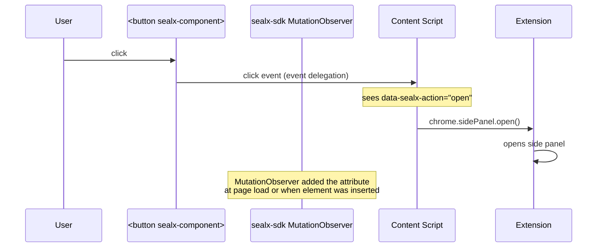

# SealX SDK — Integration Guide

> **Audience**: Frontend developers integrating the SealX browser extension into their web application.
> **Prerequisite**: `npm install sealx-sdk` and install the SealX browser extension in Chrome.
> **Scenario**: All examples use a fictional app called **`sealx-demo-app`** — a React + TypeScript document signing SPA — so examples across docs stay consistent.

---

## Table of Contents

1. [Overview](#overview)
2. [Quick Start (5 minutes)](#quick-start-5-minutes)
3. [Side Panel Gesture Relay](#side-panel-gesture-relay)
4. [Batch Signing (AsyncGenerator)](#batch-signing-asyncgenerator)
5. [Element Location & Panel Close Events](#element-location--panel-close-events)
6. [Error Handling](#error-handling)
7. [Common Pitfalls](#common-pitfalls)

---

## Overview

**What SealX does**: SealX is a browser extension that enables cryptographic signing of documents. Your web app uses the `sealx-sdk` to communicate with the extension and trigger signing flows.

**What you'll build in this guide**:

- ✅ Check if the extension is installed
- ✅ Initialize a session for a user
- ✅ Bind a public key (one-time setup)
- ✅ Sign documents (single + batch)
- ✅ Listen for signing results
- ✅ Handle errors gracefully

---

## Quick Start (5 minutes)

### Step 1: Install

```bash
npm install sealx-sdk
```

### Step 2: Check extension availability

```typescript
import { isSealxActive } from 'sealx-sdk';

const available = await isSealxActive();
if (!available) {
  alert('Please install the SealX browser extension to continue');
}
```

### Step 3: Initialize session

```typescript
import { initSealx } from 'sealx-sdk';

// Call once when the user logs in
await initSealx(currentUser.id);
```

### Step 4: Bind public key (one-time)

```typescript
import { bindSealx } from 'sealx-sdk';

// Opens the extension popup; user completes key binding
const publicKey = await bindSealx(currentUser.id);
// Save publicKey to your backend
await backend.saveUserKey(currentUser.id, publicKey);
```

### Step 5: Sign a document

```typescript
import { signBySealx, SealxSignTask } from 'sealx-sdk';

const task: SealxSignTask = {
  taskId: 'doc-123',
  taskType: 'eip712',
  command: 'signTypedData',
  signContent: buildSignContent(documentContent),
  validUntilTime: 'hours',
};

const signature = await signBySealx<{ signature: string }>(task);
await backend.saveSignature('doc-123', signature.signature);
```

### Step 6: Listen for results (optional but recommended)

```typescript
import { onSign } from 'sealx-sdk';

const cleanup = onSign(async (request) => {
  const { taskId, signatures } = request.payload;
  console.log(`Document ${taskId} signed:`, signatures);
  await backend.confirm(taskId, signatures);
});

// Cleanup when component unmounts
useEffect(() => cleanup, []);
```

**That's it.** You've integrated SealX in 6 steps. Read on for advanced topics.

---

## Side Panel Gesture Relay

### The Problem

When the SealX extension is opened as a Chrome Side Panel, the `signBySealx()` call internally triggers `chrome.sidePanel.open()`. Browsers **reject** this call unless it's triggered by a real user click — pure JavaScript calls are blocked.

### The Solution: `sealx-component`

Add the `sealx-component` boolean attribute to any button that should trigger a signing flow:

```html
<button sealx-component onclick="handleSign()">Sign Document</button>
```

The SDK handles the rest automatically:

1. On page load and on every DOM mutation, the SDK scans for `sealx-component` elements.
2. It adds `data-sealx-action="open"` to each one.
3. When the user clicks, the content script sees the attribute and calls `chrome.sidePanel.open()`.

### Why user gesture is required

- Chrome's `sidePanel.open()` API has a strict user-gesture requirement.
- If you call `signBySealx()` from a JavaScript callback (not a click handler), Chrome will reject it with an error.
- The `sealx-component` attribute bridges this gap by letting the SDK intercept the native click and pass it through as a valid gesture.

### The full chain



### Framework integration

The attribute works with any framework:

**React**:
```tsx
<button sealx-component onClick={handleSign}>Sign</button>
```

**Vue**:
```html
<button sealx-component @click="handleSign">Sign</button>
```

**Plain HTML**:
```html
<button sealx-component onclick="handleSign()">Sign</button>
```

> **Note**: The attribute name is exactly `sealx-component`. It's a boolean attribute — do NOT assign a value. `<button sealx-component="true">` is misleading, and `<button sealx-component="false">` still activates it because any non-empty value makes the attribute present.

> **Dynamic elements**: The SDK uses a `MutationObserver` to detect newly added or attribute-modified elements, so dynamically rendered buttons (e.g., from React/Vue) are picked up automatically.

---

## Batch Signing (AsyncGenerator)

### The Problem

When you need to sign many documents at once, calling `signBySealx()` per document opens the popup N times. The batch API opens the popup once and streams results as they're completed.

### The API

Pass an array of tasks to `signBySealx()` — it returns an `AsyncGenerator`:

```typescript
const generator = await signBySealx(tasks);
for await (const signature of generator) {
  // signature is the payload for one task
}
```

### Full Example

```typescript
import { signBySealx, SealxSignTask, SignException } from 'sealx-sdk';

async function signAllDocuments(docs: Document[]) {
  const tasks: SealxSignTask[] = docs.map((doc) => ({
    taskId: doc.id,
    taskType: 'eip712',
    command: 'signTypedData',
    signContent: buildSignContent(doc.content),
    validUntilTime: 'hours',
  }));

  const generator = await signBySealx<{ signature: string }>(tasks);
  if (!generator || typeof generator[Symbol.asyncIterator] !== 'function') {
    throw new Error('Expected AsyncGenerator from batch signing');
  }

  const results = [];
  try {
    for await (const signature of generator) {
      results.push(signature);
      updateProgressUI(results.length, docs.length);
    }
  } catch (error) {
    if (error instanceof SignException) {
      // Some task failed mid-stream; `results` contains completed signatures
      console.error(`Batch stopped at ${results.length}/${docs.length}:`, error);
    }
    throw error;
  }

  // All done
  await backend.saveAllSignatures(results);
  return results;
}
```

### Error handling in batch

- If a single task in the batch fails, `SignException` is thrown.
- Already-yielded signatures in the `for await` loop are preserved — they were successfully signed.
- The extension typically closes the popup on batch failure, so you need to retry from scratch for the remaining tasks.

---

## Element Location & Panel Close Events

### Locating elements in the page

The extension can ask your app to highlight specific elements in the page (e.g., to show the user which field is being signed). Your app opts in by:

1. Registering which `data-key` attributes are locatable:
   ```typescript
   import { registerLocatableKeys } from 'sealx-sdk';
   registerLocatableKeys(['orderId', 'amount', 'recipient']);
   ```

2. Subscribing to locate events:
   ```typescript
   import { onLocateElement } from 'sealx-sdk';

   useEffect(() => {
     const cleanup = onLocateElement(); // uses default location logic
     return cleanup;
   }, []);
   ```

The SDK finds the element by `data-key`, scrolls it into view, and highlights it for 3 seconds.

### Panel close events

When the user closes the Side Panel, you may want to refresh your UI state:

```typescript
import { onPanelClose } from 'sealx-sdk';

useEffect(() => {
  const cleanup = onPanelClose(() => {
    setPanelOpen(false);
    refreshDataFromBackend();
  });
  return cleanup;
}, []);
```

---

## Error Handling

### Exception hierarchy

All SealX-specific errors extend `SealxException`:

```
SealxException
├── SealxUnavailableException   — extension not installed/active
├── SealxUninitializedException — forgot to call initSealx
├── SessionException            — session init/connection failed
├── PkException                 — public key mismatch
└── SignException               — signing operation failed
```

### instanceof pattern (recommended)

```typescript
import {
  SealxUnavailableException,
  SealxUninitializedException,
  SessionException,
  PkException,
  SignException,
} from 'sealx-sdk';

async function safeSign(task: SealxSignTask) {
  try {
    return await signBySealx(task);
  } catch (error) {
    if (error instanceof SealxUnavailableException) {
      showInstallPrompt();
      return null;
    }
    if (error instanceof SealxUninitializedException) {
      await initSealx(currentUser.id);
      return await signBySealx(task); // retry once
    }
    if (error instanceof SessionException) {
      await connectSealx(currentUser.id);
      return await signBySealx(task); // retry once
    }
    if (error instanceof PkException) {
      await bindSealx(currentUser.id); // complete key binding
      return await signBySealx(task); // retry once
    }
    if (error instanceof SignException) {
      showSignError('Signing failed. Please try again.');
      return null;
    }
    throw error; // unexpected
  }
}
```

### Recovery actions

| Error | Meaning | Recovery |
|---|---|---|
| `SealxUnavailableException` | Extension missing or inactive | Prompt user to install/enable extension |
| `SealxUninitializedException` | `initSealx()` not called | Call `initSealx(userId)` |
| `SessionException` | Session init failed | Call `connectSealx(userId)` to retry |
| `PkException` | Public key mismatch (pending change) | Call `bindSealx(userId)` to complete |
| `SignException` | Signing failed | Retry, or show error to user |

---

## Common Pitfalls

### Pitfall 1: Misusing `sealx-component` with a value

❌ **Wrong**:
```html
<button sealx-component="true">Sign</button>
<button sealx-component="false">Sign</button>
```

✅ **Correct**:
```html
<button sealx-component>Sign</button>
```

**Why**: `sealx-component` is a boolean attribute. `="false"` still activates it because any non-empty value counts as "present".

---

### Pitfall 2: Calling `signBySealx()` without a user gesture

❌ **Wrong**:
```tsx
useEffect(() => {
  signBySealx(task); // rejected by Chrome
}, []);
```

✅ **Correct**:
```tsx
<button sealx-component onClick={handleSign}>Sign</button>

async function handleSign() {
  await signBySealx(task); // works because of user click
}
```

**Why**: Chrome requires a real user click to open the side panel. The `sealx-component` attribute lets the SDK intercept the click.

---

### Pitfall 3: Forgetting to `await` `initSealx()` before `bindSealx()`

❌ **Wrong**:
```typescript
initSealx(userId); // not awaited
bindSealx(userId); // throws SealxUninitializedException
```

✅ **Correct**:
```typescript
await initSealx(userId);
await bindSealx(userId);
```

**Why**: `initSealx()` is async. `bindSealx()` checks `account.userId` synchronously; without awaiting, it sees null.

---

### Pitfall 4: Treating `signBySealx` batch as a `Promise`

❌ **Wrong**:
```typescript
const signatures = await signBySealx(tasks); // tasks is an array
console.log(signatures[0]); // undefined! signatures is AsyncGenerator, not Array
```

✅ **Correct (with explicit type cast, recommended)**:
```typescript
const generator = (await signBySealx(tasks)) as AsyncGenerator<{ signature: string }>;
for await (const sig of generator) {
  console.log(sig);
}
```

✅ **Also correct (runtime type check via `Symbol.asyncIterator`)**:
```typescript
const result = await signBySealx(tasks);
if (result && typeof (result as any)[Symbol.asyncIterator] === 'function') {
  for await (const sig of result as AsyncGenerator<{ signature: string }>) {
    console.log(sig);
  }
} else if (result) {
  // single signature payload — this branch won't run for batch input
}
```

**Why**: Batch mode returns an `AsyncGenerator`, not a Promise<Array>. The SDK's return type is `Promise<T | AsyncGenerator<T> | undefined>` — strict TypeScript requires you to narrow the union before using the result. The easiest pattern is an `as AsyncGenerator<T>` cast when you know the input is an array.

---

### Pitfall 5: Using `onSign` without a taskId listens to ALL tasks

❌ **Accidental**:
```typescript
onSign(async (request) => {
  // fires for every single task in the app
  console.log('Got signature:', request.payload);
});
```

✅ **Intentional**:
```typescript
// Listen only for a specific task
onSign(async (request) => {
  console.log('task-123 signed:', request.payload);
}, 'task-123');
```

**Why**: Without a taskId filter, the callback fires for every signing result in your app, which is usually not what you want.

---

### Pitfall 6: Checking `isSealxActive()` to verify session validity

❌ **Wrong**:
```typescript
if (await isSealxActive()) {
  // assumes session is valid
  await signBySealx(task);
}
```

✅ **Correct**:
```typescript
if (isSessionAvailable()) {
  // session is valid and not expired
  await signBySealx(task);
} else {
  await connectSealx(userId);
  await signBySealx(task);
}
```

**Why**: `isSealxActive()` only checks if the extension is installed and responding. `isSessionAvailable()` checks if you have a valid session with a non-expired time.

---

### Pitfall 7: Manually calling `closeSealx()` after `sendSignResponse()`

❌ **Wrong**:
```typescript
await sendSignResponse(taskId);
await closeSealx(); // redundant
```

✅ **Correct**:
```typescript
await sendSignResponse(taskId); // auto-sends CLOSE after 500ms
```

**Why**: `sendSignResponse()` automatically sends a `CLOSE` message 500ms after sending the `SIGN_RESPONSE`. You don't need to call `closeSealx()` manually.

---

## Next Steps

- **[API Reference](./api-reference.md)** — complete details on every API, with parameters, return types, and error behavior.
- **[README](../README.md)** — entry point, API overview table, links back here.
- **Internal maintainers**: see `docs/sdk-internal/` at repo root for architecture and protocol docs.
